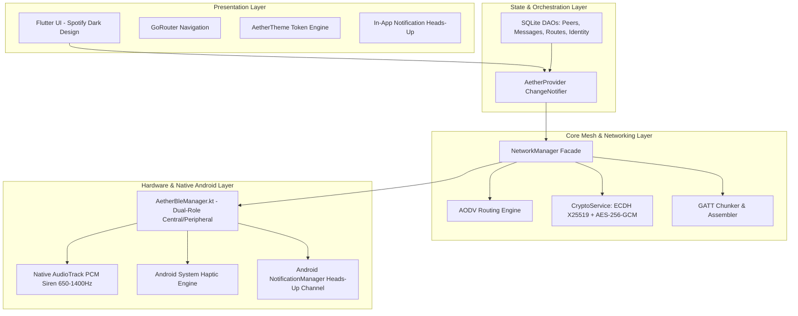
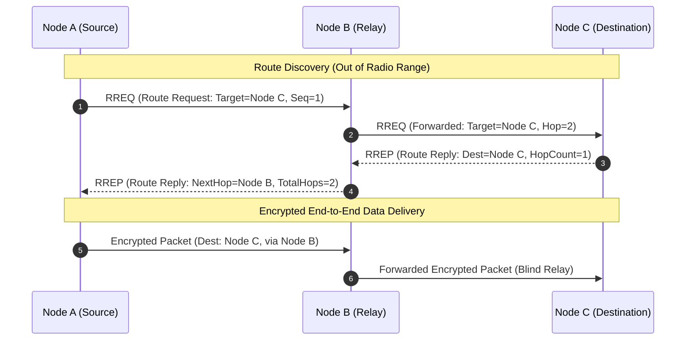
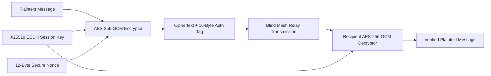

# AetherLink System Architecture & Protocol Specification

## 1. High-Level Architecture Overview

AetherLink is an autonomous, decentralized disaster communication mesh network built for mobile Android devices. It operates completely offline with zero reliance on cellular towers, Wi-Fi infrastructure, or internet uplinks.

---

## 2. Physical & Transport Layer: Dual-Role Bluetooth Low Energy

Every device running AetherLink functions simultaneously as a **GATT Client (Central)** and a **GATT Server (Peripheral)**:

1. **BLE Advertising & Discovery**:
   - **Primary Advertising Frame (`data`)**: Contains the 128-bit `SERVICE_UUID` (21 bytes total <= 31 bytes legacy BLE advertisement frame limit).
   - **Scan Response Frame (`scanResponse`)**: Contains Manufacturer Data (`0xAE78`) with local Node ID and truncated display name (28 bytes <= 31 bytes limit).
   - **Scanning Engine**: Operates with `ScanSettings.SCAN_MODE_LOW_LATENCY` (100% duty cycle). Features dual hardware filters for `SERVICE_UUID` and `MANUFACTURER_ID` with automatic fallback to software parsing for hardware-agnostic chipset support.

2. **Packet Chunking & Assembly**:
   - Standard BLE GATT MTU ranges between 23 and 512 bytes.
   - The `GattChunker` segments higher-level binary packet envelopes into MTU-safe fragments with 4-byte sequence headers and transparently reassembles them at the receiver before delivery.

---

## 3. Network & Routing Layer: AODV Mobile Mesh

AetherLink implements a mobile-optimized **Ad-hoc On-Demand Distance Vector (AODV)** routing algorithm:

- **RREQ (Route Request)**: Broadcasts when a destination node is not in the active routing table.
- **RREP (Route Reply)**: Unicast back along the reverse path with hop counts and destination sequence numbers.
- **RERR (Route Error)**: Emitted when an active link breaks to invalidate broken paths.
- **Loop Prevention**: TTL decrementation, sequence number freshness, and a circular message ID cache eliminate broadcast storms.

---

## 4. Cryptographic Security Layer

- **Identity Generation**: Ed25519 keypair for identity signing, X25519 keypair for key exchange.
- **Key Agreement**: Instant mutual ECDH upon peer connection with domain separation via HKDF-SHA256.
- **Authenticated Encryption**: AES-256-GCM authenticated cipher with 12-byte IV and 16-byte MAC tag.
- **Blind Forwarding**: Intermediate relay nodes see only envelope headers; payload ciphertexts remain indecipherable and tamper-evident.

---

## 5. Emergency SOS Siren: Native Audio Synthesis

- When an emergency SOS packet is detected across the mesh, Android's `AudioTrack` synthesizes a dual-frequency audio sine wave directly into 16-bit PCM memory (`650 Hz ↔ 1400 Hz`) on `STREAM_ALARM`.
- Operates 100% offline with zero external audio assets or player dependencies.
- Synchronized with hardware vibration pulses (`longArrayOf(0, 450, 150, 450, 150, 450)`).
