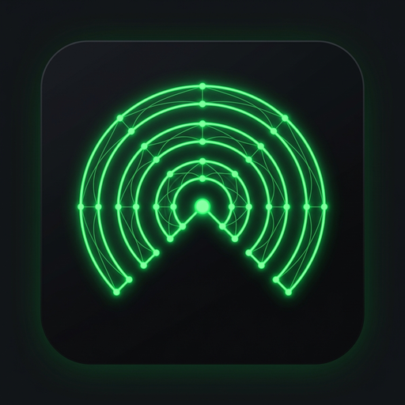
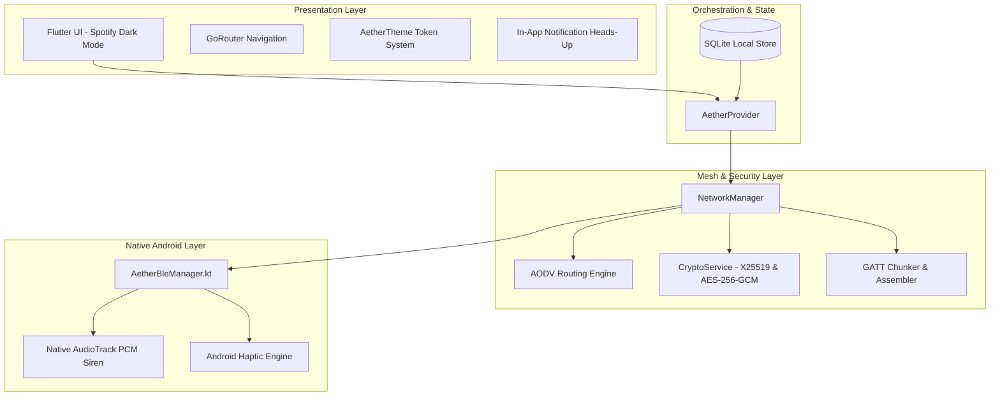

<div align="center">



# AetherLink
### Decentralized Disaster Communication Mesh Network

**100% Offline • Zero Internet • Peer-to-Peer Bluetooth Low Energy • End-to-End Encrypted**

[](https://github.com/AdityaThapliyal-09/AetherLink/releases)
[](https://github.com/AdityaThapliyal-09/AetherLink)
[](LICENSE)

[](https://flutter.dev)
[](https://dart.dev)
[](https://www.android.com)
[](SECURITY.md)
[](ARCHITECTURE.md)

</div>

---

## 📌 Problem & Motivation

During natural disasters (earthquakes, flash floods, landslides, hurricanes) and severe infrastructural disruptions, centralized cellular towers and fiber-optic backbones are either physically destroyed or overloaded. Survivors, volunteers, and first responders find themselves completely cut off from communication.

**AetherLink** transforms commodity Android smartphones into autonomous, self-healing nodes of an encrypted, peer-to-peer ad-hoc wireless mesh network. Powered exclusively by Bluetooth Low Energy (BLE), messages, emergency broadcasts, and high-priority distress signals hop dynamically from smartphone to smartphone across the disaster zone without a single byte of cellular data or internet access.

---

## 🌟 Key Capabilities

### 📡 1. Zero-Infrastructure Autonomous Peering
* **Dual-Role BLE Architecture**: Every node operates simultaneously as a GATT Client (Central) and GATT Server (Peripheral), broadcasting beacons while continuously listening for peers.
* **Sub-Second Discovery**: Custom dual-filter scanning engine using Manufacturer Data (`0xAE78`) and Service UUIDs operating at low latency and maximum radio TX power.
* **31-Byte Overflow Resilience**: Adheres strictly to legacy BLE 31-byte advertisement payload constraints via an optimized split-frame architecture.

### 🔄 2. Multi-Hop Dynamic Mesh Routing (AODV)
* **Ad-hoc On-Demand Distance Vector (AODV)**: Self-configuring mesh routing protocol dynamically discovers communication paths when destination nodes are outside direct radio range.
* **Store-and-Forward**: Queues undelivered packets and flushes them automatically when an intermediate route or next-hop peer becomes reachable.
* **Loop Prevention & TTL**: Enforces strict Time-To-Live (TTL) decrementation, hop counting, and a seen-message circular cache to eliminate packet storms and infinite routing loops.

### 🔐 3. Military-Grade End-to-End Encryption (E2EE)
* **Asymmetric Key Agreement**: Nodes generate an X25519 Diffie-Hellman keypair upon setup. Mutual key exchange occurs automatically upon connection, deriving a 256-bit symmetric session key via HKDF-SHA256.
* **Authenticated Encryption**: All private messages and delivery receipts are protected with **AES-256-GCM** with 12-byte secure random nonces and 16-byte MAC authentication tags.
* **Blind Packet Relaying**: Intermediate mesh nodes forward ciphertexts blindly; relay hops cannot inspect, alter, or forge message contents.
* **Out-of-Band Fingerprint Verification**: Cryptographic SHA-256 fingerprints can be validated in person to prevent Man-In-The-Middle (MITM) attacks.

### 🚨 4. Emergency SOS Broadcast & Native Audio Siren
* **Instant Priority Mesh Flooding**: Single-tap emergency SOS broadcast that floods rapidly across the entire mesh with highest transmission priority.
* **Zero-Asset Native Audio Siren**: Incoming SOS alerts trigger an Android native dual-frequency rising-and-falling siren (`650 Hz ↔ 1400 Hz`) on `STREAM_ALARM` via PCM 16-bit `AudioTrack` synthesis with synchronized hardware vibration pulses — functioning 100% offline with zero external audio files.

### 🎨 5. Spotify-Inspired Dark Design System
* **Aesthetic**: Custom dark theme adopting Spotify's visual language: `#121212` background canvas, `#181818` card containers, `#1F1F1F` elevated controls, `#1ED760` Spotify Green accents, and `#F3727F` SOS emergency triggers.
* **Geometry**: Spotify standard 8px card corners (`BorderRadius.circular(8)`), full-pill buttons and chips (`BorderRadius.circular(9999)`), and circular action buttons.
* **Heads-Up In-App Overlay**: Animated top-sliding banner notifies users of incoming messages while browsing other screens, with one-tap deep navigation into the chat.

### 🗺️ 6. Real-Time Interactive Topology Visualizer
* **Canvas Mesh Graph**: Real-time custom painter visualizes direct Bluetooth links, relay edges, hop distances, and active communication paths on an interactive graph canvas.

---

## 🏗️ System Architecture



---

## 📋 Packet Protocol Specification

Every packet in the AetherLink mesh conforms to the unified **AETH-v1** envelope:

| Field | Type | Description |
| :--- | :--- | :--- |
| `protocolVersion` | `uint8` | Protocol version (`0x01`) |
| `packetType` | `uint8` | Packet opcode (`HELLO`, `KEY_EXCHANGE`, `DATA`, `RREQ`, `RREP`, `RERR`, `SOS`, `ACK`) |
| `packetId` | `string` | Unique UUID / monotonic hash for deduplication |
| `originId` | `string` | Node ID of the original sender (`AETH-XXXXXXXX`) |
| `destinationId` | `string` | Node ID of the target recipient or `BROADCAST` |
| `ttl` | `uint8` | Time-to-Live hop counter (default: 7 hops) |
| `hopCount` | `uint8` | Accumulated hops traversed |
| `payload` | `bytes / JSON` | AES-256-GCM ciphertext + IV + Tag (for DATA) or routing control payload |

---

## 📂 Project Structure

```
AetherLink/
├── .github/                           # GitHub Community & Issue Templates
│   ├── ISSUE_TEMPLATE/                # Bug report & feature request templates
│   └── PULL_REQUEST_TEMPLATE.md       # Pull request guidelines template
├── android/                           # Native Android platform integration
│   └── app/src/main/kotlin/.../network/
│       ├── AetherBleManager.kt        # Dual-role BLE manager & siren audio synthesis
│       ├── AetherPeerConnection.kt    # BLE GATT client connection wrapper
│       └── AetherServerConnection.kt  # BLE GATT server notification queue
├── assets/images/                     # Branding assets & high-resolution app icon
├── lib/
│   ├── core/                          # Protocol constants, error handling, logging
│   ├── data/                          # SQLite schema, migrations, and DAOs
│   ├── domain/entities/               # Packet, PeerNode, Message, Route models
│   ├── features/
│   │   ├── chat/                      # End-to-end encrypted chat & conversation list
│   │   ├── home/                      # Home dashboard, active peers, metrics
│   │   ├── network/                   # Live mesh topology visualizer canvas
│   │   ├── peers/                     # Peer detail & out-of-band fingerprint verification
│   │   ├── settings/                  # Identity preferences & academic credits
│   │   └── sos/                       # Emergency distress button & network broadcast
│   ├── presentation/
│   │   ├── navigation/app_router.dart # GoRouter declarative routes & bottom navigation
│   │   ├── theme/aether_theme.dart    # Spotify design system tokens & typography
│   │   └── widgets/                   # Reusable Spotify cards, badges, and overlays
│   └── services/
│       ├── bluetooth/                 # BLE service, network manager, GATT chunker
│       ├── encryption/                # PointyCastle Curve25519 ECDH & AES-256-GCM
│       └── routing/                   # AODV route discovery & routing table
├── test/                              # Comprehensive unit & widget test suites
│   ├── crypto_test.dart               # ECDH key agreement & AES-GCM cipher tests
│   └── widget_test.dart               # UI rendering & smoke tests
├── ARCHITECTURE.md                    # Deep-dive architectural specification
├── CHANGELOG.md                       # Release notes & version history
├── CONTRIBUTING.md                    # Contribution guidelines & coding standards
├── LICENSE                            # MIT License
└── SECURITY.md                        # Security policy & vulnerability reporting
```

---

## ⚡ Getting Started

### Option 1: Direct APK Download
Download the latest pre-compiled release APK from [GitHub Releases](https://github.com/AdityaThapliyal-09/AetherLink/releases):
```bash
# Install directly via ADB onto connected Android smartphone:
adb install -r AetherLink.apk
```

### Option 2: Build from Source

#### Prerequisites
* Flutter SDK (Version 3.24 or higher)
* Android SDK (API 34 / Java 17)
* Android smartphone running Android 8.0 (API 26) or higher with Bluetooth Low Energy support

#### 1. Clone & Fetch Dependencies
```bash
git clone https://github.com/AdityaThapliyal-09/AetherLink.git
cd AetherLink
flutter pub get
```

#### 2. Run Verification & Tests
```bash
flutter analyze
flutter test
```

#### 3. Build Production Release APK
```bash
flutter build apk --release
```
The optimized release APK will be generated at:
`build/app/outputs/flutter-apk/app-release.apk`

---

## 📱 Hardware & Permission Setup

To enable Bluetooth Low Energy mesh networking on Android:
1. **Bluetooth**: Must be toggled **ON** in Quick Settings.
2. **Location (GPS)**: Must be enabled on Android 8 through 11 for BLE advertisement scanning (required by Android OS).
3. **Permissions**: On first launch, grant the prompted permissions:
   * **Android 12+**: `BLUETOOTH_SCAN`, `BLUETOOTH_ADVERTISE`, `BLUETOOTH_CONNECT`.
   * **Android 8–11**: `ACCESS_FINE_LOCATION`, `ACCESS_COARSE_LOCATION`.

---

## 👥 Academic Credits & Project Team

**AetherLink** was engineered as an academic capstone mini-project at **Graphic Era Hill University (GEHU)**.

* **Academic Session**: 2026–2027
* **Institution**: Graphic Era Hill University (GEHU), Dehradun
* **School**: School of Computing
* **Department**: Department of Computer Applications (BCA A2)

### 🎓 Project Mentorship
* **Ms. Nidhi Joshi** — Assistant Professor, Department of Computer Applications, School of Computing, GEHU

### 💻 Development Team
| Name | University Roll No. | Core Project Responsibilities |
| :--- | :--- | :--- |
| **Aditya Thapliyal** *(Team Leader)* | **2421057** | System Architecture, Protocol Engine, BLE Integration & Spotify UI |
| **Ankit Singh Rawat** | **2421112** | Mesh Networking, AODV Routing Engine & Topology Visualization |
| **Suhail** | **2421614** | Cryptographic Security (ECDH/AES-GCM), Audio Siren & Hardware Interface |

---

## 📄 License

This project is licensed under the **MIT License** — see the [LICENSE](LICENSE) file for details.
